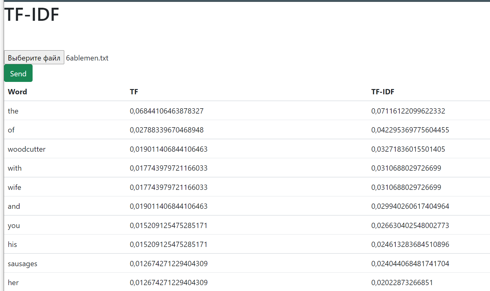

# TF-IDF files calculator example
Application for calculating a `term frequency–inverse document frequency`  from text file. 
The application has one page that implements downloading a file and displaying the result of calculations. 
It is a table with a list of the last 50 words sorted by decreasing TF-IDF index.
Columns of the table: `Word`, `TF`, `TF-IDF`.

---




```sh
$ pip install -r requirements.txt
```
---

1) python 3.8 
2) OC - Linux
3) asgiref==3.4.1
4) Django==3.2.7
5) djangorestframework==3.12.4
6) numpy==1.21.2
7) pandas==1.3.2
8) python-dateutil==2.8.2
9) pytz==2021.1
10) six==1.16.0
11) sqlparse==0.4.1
